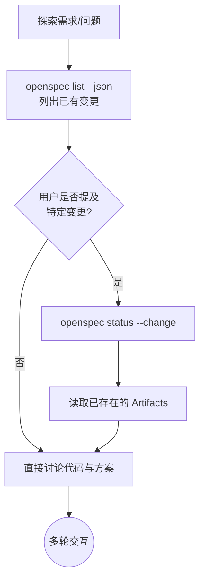
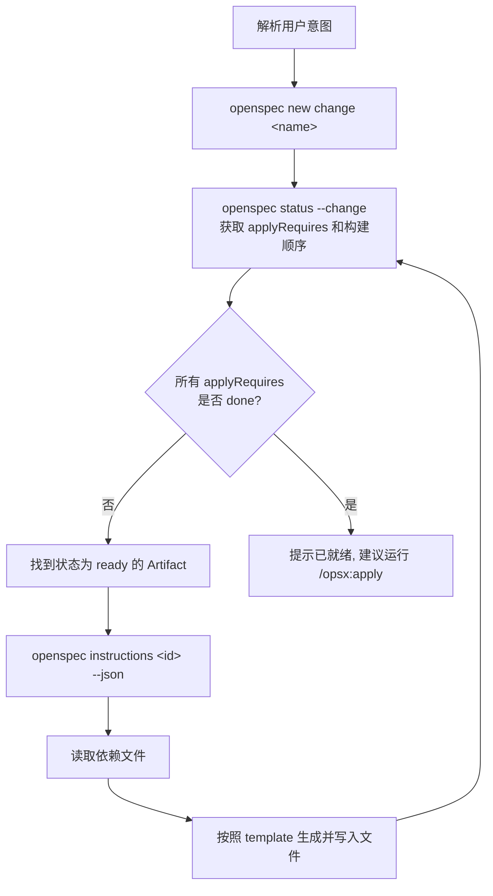
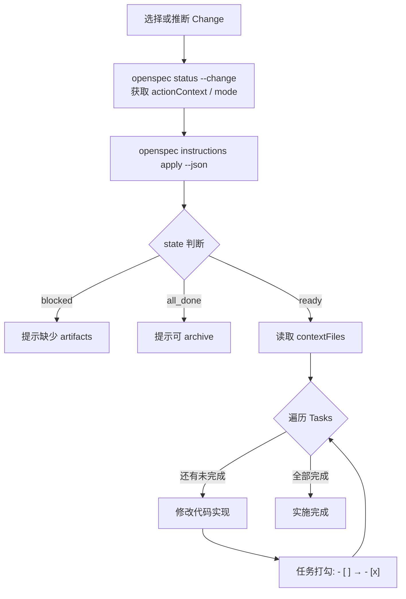
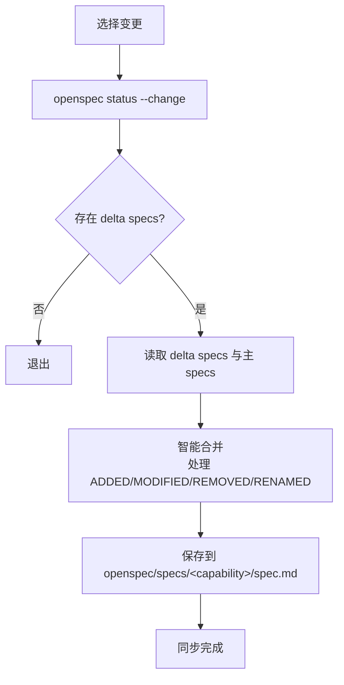
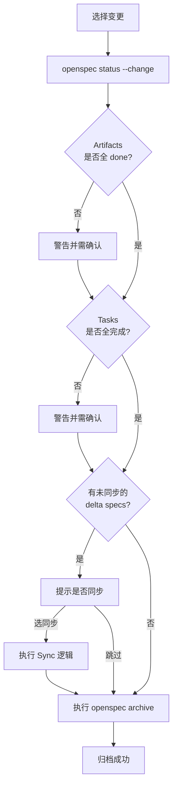
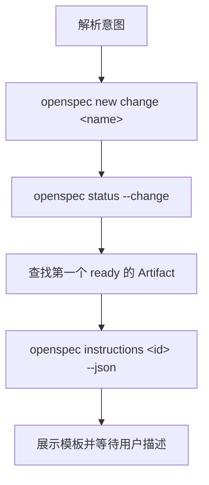
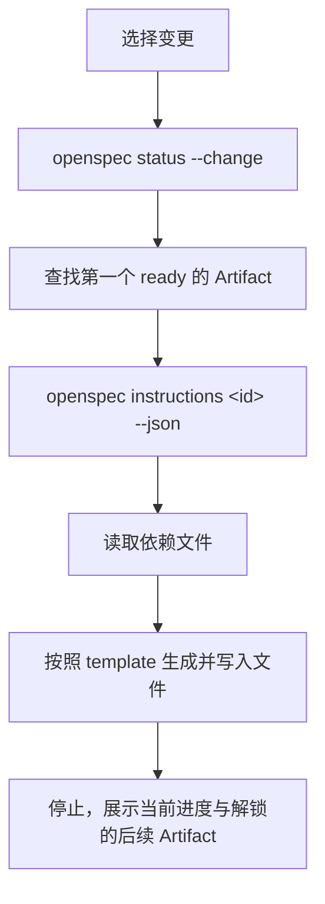
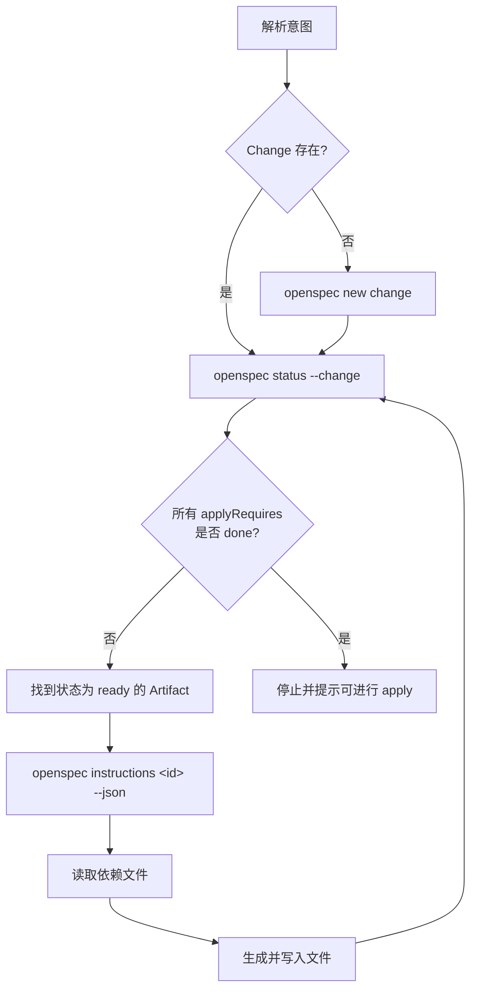
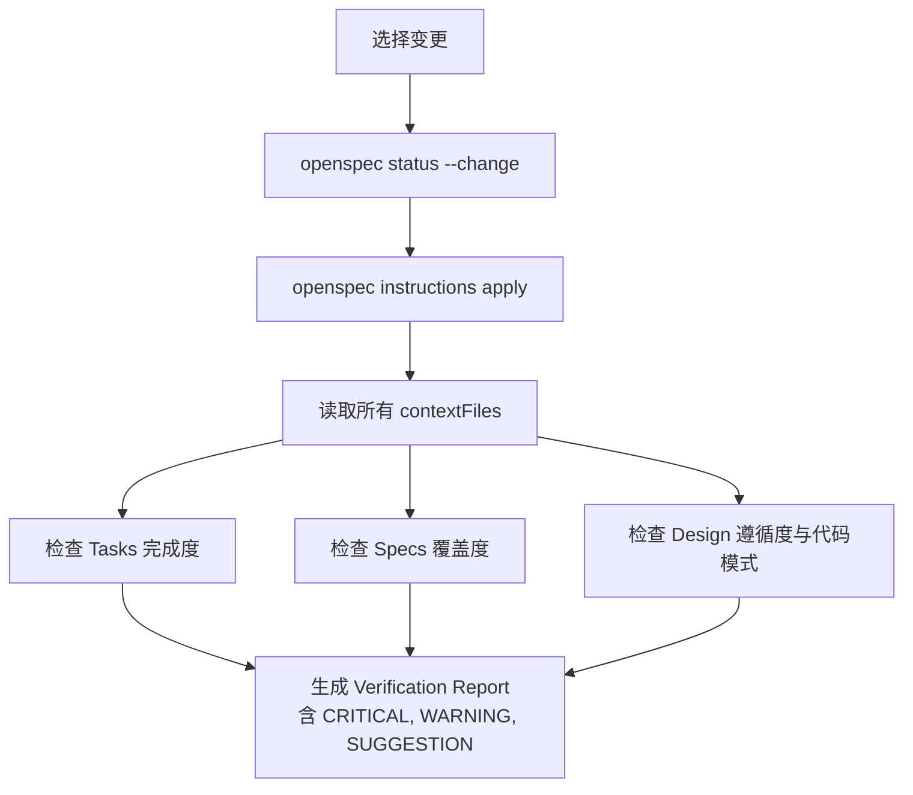
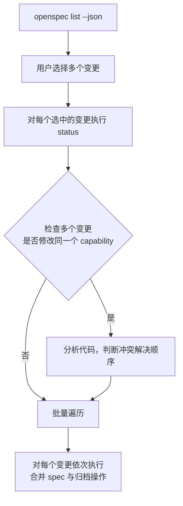

* TOC
{:toc}

[OpenSpec](https://github.com/Fission-AI/OpenSpec) 是一个轻量级的 spec 框架，它是现在 AI 工程实践里流行的 SDD (Spec-Driven Development) 开发流程的一个 spec 组织工具。本文基于 OpenSpec **v1.4.1** 整理。

## OpenSpec CLI 命令

OpenSpec 用 npm 装：


npm install -g @fission-ai/openspec@latest
cd your-project
openspec init


`openspec init` 是项目级初始化，它会做几件事：

* 在项目里建目录 `openspec/specs/` （存放的是这个项目的长期真值的 spec 文件）以及目录`openspec/changes/` （存放这个项目正在进行的变更 spec 文件）；
* 生成 `openspec/config.yaml` 文件，里面放项目级的 `context` 和 `rules`，每次生成 artifact 时都会注入。
* 根据用户选择的 AI 工具把对应的斜杠命令或 skill 写到工具的目录下（Claude Code 是 `.claude/commands/opsx/<id>.md` 或 `.claude/skills/openspec-*/SKILL.md`）；

要得到更细的工作流如下操作，OpenSpec 会把选择保存成 `custom` profile，这个是全局性的配置。


# 全局：选择 workflow 和安装形式（skills / commands / both）
openspec config profile

# 每个已初始化项目：把新的全局 profile 同步到工具文件
cd your-project
openspec update


OpenSpec 里每一个 change 都是 `openspec/changes/<name>/` 下的一个目录，里面有 `proposal.md`、`design.md`、`tasks.md` 以及一组 delta `specs/`。归档时 delta spec 会被合进顶层 `openspec/specs/`，作为项目的“真值”长存。

除了核心的 `init` 和 `update`，OpenSpec CLI 提供了丰富的命令库。复杂的命令（如 workspaces 和 context-store）主要用于跨项目协调，简单的状态与配置查询可以通过下方表格了解：

| 命令分类 | 命令 | 说明 |
|:---|:---|:---|
| **Setup (初始化)** | `init`, `update` | 初始化或升级 OpenSpec 配置文件 |
| **Browsing (浏览)** | `list`, `view`, `show` | 浏览和查看变更及 spec 状态 |
| **Validation (校验)** | `validate` | 校验变更和 specs 是否存在问题 |
| **Lifecycle (归档)** | `archive` | 将完成的变更归档 |
| **Workflow (工作流)** | `new change`, `set change`, `status`, `instructions`, `templates`, `schemas` | 提供底层的状态控制与提示词组装 |
| **Schemas (流程定义)** | `schema init`, `schema fork`, `schema validate`, `schema which` | 创建、复刻、校验自定义的 Schema 工作流 |
| **Config (配置)** | `config` | 查看或修改项目的各项配置 |
| **Utility (辅助)** | `feedback`, `completion` | 提供反馈与生成终端补全脚本 |

其他还有工作区（Workspaces）管理，共享上下文（Shared Context）与 Initiative 相关命令，还在 beta 版本，这里不展开。

## OpenSpec AI 工具命令

上面列出的 `/opsx:<command>` 是在 AI 工具里的命令，每个命令本质上就是一个 prompt 文件，它会引导 AI 去调用上面的 CLI 命令并照着 JSON 结果行动。每个命令在内部有一套严格的工作流与判定逻辑。下面按命令梳理它们内部的运行流程：

### 核心工作流 (Core Profile)

#### `/opsx:explore` (探索与构思)
用于在正式建立 Change 前，分析代码、讨论方案和澄清需求。

#### `/opsx:propose` (创建并计划)
一步到位创建一个 change，生成 proposal / design / tasks。

#### `/opsx:apply` (实施任务)
按 `tasks.md` 实施，逐条勾选。

#### `/opsx:sync` (同步规格)
把 change 里的 delta spec 同步回主 spec。

#### `/opsx:archive` (归档)
完成之后归档这个 change。

### 扩展工作流 (Expanded Profile)

#### `/opsx:new` (只建脚手架)
只创建 change 目录并展示第一个 artifact 的模板，不实际写 artifact。

#### `/opsx:continue` (单步推进)
一次只生成下一个 ready 的 artifact。

#### `/opsx:ff` (快进生成)
一口气生成实现前所需的全部 artifact，如果 change 不存在会先创建。

#### `/opsx:verify` (验证实现)
归档前检查实现是否与 proposal / specs / design / tasks 一致。

#### `/opsx:bulk-archive` (批量归档)
一次归档多个已完成的 change，并处理多个 change 改同一 capability 的冲突。

## 工作原理

OpenSpec 是 **schema 定义流程，CLI 计算状态和提示词，AI 只负责按当前指令读文件、写文件、勾任务。**它的“流程”并不藏在某个 AI prompt 里，而是落在 `schema.yaml` 和 CLI 的状态计算里。AI 编辑器里安装的 `/opsx:propose`、`/opsx:apply` 之类命令，本质上是引导 AI 去调用这些 CLI 命令并照着 JSON 结果行动。

### 流程图 schema

默认的 `spec-driven` schema 定义了 4 个 artifact：


proposal
   │
   ├──► specs
   │
   └──► design
          │
specs ────┘
   │
   ▼
tasks


对应到内置 `schemas/spec-driven/schema.yaml`，核心就是：


artifacts:
  - id: proposal
    generates: proposal.md
    requires: []

  - id: specs
    generates: "specs/**/*.md"
    requires: [proposal]

  - id: design
    generates: design.md
    requires: [proposal]

  - id: tasks
    generates: tasks.md
    requires: [specs, design]

apply:
  requires: [tasks]
  tracks: tasks.md


OpenSpec 目前的完成状态很朴素，主要看输出文件是否存在，而不是解析内容质量。内容是否合格由 AI 命令里的指导、`openspec validate`、人的 review，以及后续测试来兜底。

同一个项目可以同时存在多个 schema。某个 change 最终使用哪个 schema，优先级是：

1. CLI 参数：`--schema <name>`；
2. change 目录里的 `.openspec.yaml`；
3. 项目配置 `openspec/config.yaml` 的 `schema`；
4. 默认 `spec-driven`。

schema 文件本身也有三层来源，优先级是：

1. 项目级：`<project>/openspec/schemas/<name>/schema.yaml`；
2. 用户级：OpenSpec 全局数据目录下的 `schemas/<name>/schema.yaml`；
3. 包内置：npm 包里的 `schemas/<name>/schema.yaml`。

### `openspec status` 命令返回是状态机的快照

假设 change 目录里已经有 `proposal.md`，还没有 specs / design / tasks，`openspec status --change add-dark-mode --json` 会返回类似这样的结构：


{
  "changeName": "add-dark-mode",
  "schemaName": "spec-driven",
  "changeRoot": "/repo/openspec/changes/add-dark-mode",
  "isComplete": false,
  "applyRequires": ["tasks"],
  "artifactPaths": {
    "proposal": {
      "outputPath": "proposal.md",
      "resolvedOutputPath": "/repo/openspec/changes/add-dark-mode/proposal.md",
      "existingOutputPaths": ["/repo/openspec/changes/add-dark-mode/proposal.md"]
    }
  },
  "artifacts": [
    { "id": "proposal", "outputPath": "proposal.md", "status": "done" },
    { "id": "specs", "outputPath": "specs/**/*.md", "status": "ready" },
    { "id": "design", "outputPath": "design.md", "status": "ready" },
    { "id": "tasks", "outputPath": "tasks.md", "status": "blocked", "missingDeps": ["design", "specs"] }
  ]
}


这就是 `/opsx:propose` 或 `/opsx:continue` 的控制面：AI 不需要自己推断“下一步该写什么”，只需要看哪些 artifact 是 `ready`，然后逐个生成。

### `openspec instructions` 是给单个 artifact 的任务包

当某个 artifact ready 之后，AI 会继续调用：


openspec instructions specs --change add-dark-mode --json


CLI 会把 schema、项目配置、依赖文件路径、输出路径组装成一个单个 artifact 的“任务包”，主要字段包括：

| 字段 | 来自哪里 | 作用 |
|:---|:---|:---|
| `artifactId` / `schemaName` | 当前 schema | 告诉 AI 正在写哪类 artifact |
| `resolvedOutputPath` | `changeRoot + generates` | 告诉 AI 写到哪里，避免猜路径 |
| `dependencies` | `requires` + 当前文件状态 | 告诉 AI 先读哪些上游 artifact |
| `context` | `openspec/config.yaml` 的 `context` | 项目背景，所有 artifact 都会看到 |
| `rules` | `config.yaml` 的 `rules.<artifactId>` | 只对当前 artifact 生效的额外规则 |
| `instruction` | `schema.yaml` 里该 artifact 的 `instruction` | 这类文档的写作要求 |
| `template` | `templates/<file>.md` | 这类文档的输出骨架 |
| `unlocks` | 依赖图反向关系 | 写完后会解锁哪些 artifact |

非 JSON 输出里这些内容会被包成 `<project_context>`、`<rules>`、`<dependencies>`、`<instruction>`、`<template>` 等标签。关键点是：`context` 和 `rules` 是给 AI 看的约束，**不要原样抄进最终 markdown**；`template` 才是输出文件的结构骨架。

非 JSON 输出的形状大致是这样：


<artifact id="proposal" change="add-auth" schema="spec-driven">

<task>
Create the proposal artifact for change "add-auth".
Initial proposal document outlining the change
</task>

<project_context>
<!-- This is background information for you. Do NOT include this in your output. -->
... openspec/config.yaml 里的 context ...
</project_context>

<rules>
<!-- These are constraints for you to follow. Do NOT include this in your output. -->
- ... rules.proposal 里的规则 ...
</rules>

<dependencies>
Read these files for context before creating this artifact:
<dependency id="proposal" status="done">
  <path>/repo/openspec/changes/add-auth/proposal.md</path>
  <description>Initial proposal document outlining the change</description>
</dependency>
</dependencies>

<output>
Write to: /repo/openspec/changes/add-auth/proposal.md
</output>

<instruction>
... schema.yaml 里 artifact.instruction 的内容 ...
</instruction>

<template>
<!-- Use this as the structure for your output file. Fill in the sections. -->
... templates/proposal.md 的内容 ...
</template>

<success_criteria>
<!-- To be defined in schema validation rules -->
</success_criteria>

<unlocks>
Completing this artifact enables: design, specs
</unlocks>

</artifact>


JSON 输出则保留同样信息，但以字段形式给 LLM 解析：


{
  "changeName": "add-auth",
  "artifactId": "proposal",
  "schemaName": "spec-driven",
  "changeDir": "/repo/openspec/changes/add-auth",
  "outputPath": "proposal.md",
  "resolvedOutputPath": "/repo/openspec/changes/add-auth/proposal.md",
  "existingOutputPaths": [],
  "description": "Initial proposal document outlining the change",
  "instruction": "Create the proposal document that establishes WHY...",
  "context": "... project context ...",
  "rules": ["... artifact-specific rule ..."],
  "template": "## Why\n\n...",
  "dependencies": [],
  "unlocks": ["design", "specs"]
}


`schema.yaml` 里的主要字段都会在这些输出里发挥作用：

| 字段 | 用在哪里 |
|:---|:---|
| `id` | artifact 标识，也是 `instructions <id>` 的参数 |
| `description` | 放进 `<task>` / JSON `description`，解释 artifact 是什么 |
| `instruction` | 放进 `<instruction>` / JSON `instruction`，给 LLM 写作要求 |
| `template` | 指向 `templates/<file>.md`，模板内容放进 `<template>` / JSON `template` |
| `requires` | 参与 ready / blocked 计算，也变成 `dependencies` 提示 |
| `generates` | 参与完成状态检测，也变成 `resolvedOutputPath` |

默认 `proposal` artifact 没有上游依赖，所以 `openspec instructions proposal` 不会自动把 `openspec/specs/` 里所有现有 specs 都塞进 `dependencies`。但是默认 `spec-driven` schema 的 proposal instruction 明确要求先 research existing specs，再区分 New Capabilities 和 Modified Capabilities。因此对棕地项目，LLM 应该主动检查 `openspec/specs/`，尤其是判断某个需求是新增 capability 还是修改已有 capability 时。

例如已有：


openspec/specs/
├── auth/spec.md
└── billing/spec.md


如果用户说 `/opsx:propose add password reset expiry`，合理的 proposal 应该先读 `openspec/specs/auth/spec.md`，然后写成：


## Capabilities

### New Capabilities
<!-- none -->

### Modified Capabilities
- `auth`: Password reset tokens will expire after a configurable TTL.


而不是在没检查已有 specs 的情况下随手新建一个 `password-reset` capability。

## schema 定制：一个简单但完整的例子

多数团队不需要一上来就改 schema，先用 `openspec/config.yaml` 注入项目知识就够了：


# openspec/config.yaml
schema: spec-driven

context: |
  Tech stack: TypeScript, React, Node.js
  API style: REST JSON, public API must remain backward compatible
  Testing: Vitest for unit tests, Playwright for e2e tests

rules:
  proposal:
    - Include rollback plan when behavior changes user-facing flows.
  specs:
    - Every requirement MUST include at least one #### Scenario.
  tasks:
    - Every implementation task must be small enough for one focused coding session.


当你们的流程本身不一样时，再 fork 或新建 schema：


# 推荐：先基于内置 spec-driven fork，再删改
openspec schema fork spec-driven risk-first

# 或者从零创建一个骨架
openspec schema init risk-first --description "Risk-first feature workflow"


下面是一个“风险先行”的完整 schema：先写 feature brief，再列风险，再写实现任务；只有 `tasks.md` 完成后才允许 apply，并用 `tasks.md` 追踪实现进度。

目录结构：


openspec/schemas/risk-first/
├── schema.yaml
└── templates/
    ├── brief.md
    ├── risks.md
    └── tasks.md


`schema.yaml`：


name: risk-first
version: 1
description: A small workflow that forces risk review before implementation tasks.

artifacts:
  - id: brief
    generates: brief.md
    description: One-page feature brief with scope and success criteria.
    template: brief.md
    instruction: |
      Create a concise feature brief. Focus on user value, scope boundaries,
      measurable success criteria, and what is explicitly out of scope.
    requires: []

  - id: risks
    generates: risks.md
    description: Risk review for security, data, migration, and rollout concerns.
    template: risks.md
    instruction: |
      Read brief.md first. Identify concrete risks and pair each one with a
      mitigation or an explicit reason it is acceptable.
    requires:
      - brief

  - id: tasks
    generates: tasks.md
    description: Implementation checklist derived from the brief and risks.
    template: tasks.md
    instruction: |
      Read brief.md and risks.md first. Create ordered, verifiable tasks.
      Every risk that needs engineering work must map to at least one task.
      Use checkbox items only; apply parses them for progress.
    requires:
      - brief
      - risks

apply:
  requires:
    - tasks
  tracks: tasks.md
  instruction: |
    Implement tasks in order. Keep tasks.md updated by changing completed
    items from - [ ] to - [x]. Stop and ask if a risk lacks an agreed mitigation.


`templates/brief.md`：


## Problem

<!-- What user or business problem are we solving? -->

## Scope

### In Scope

<!-- Bullet list -->

### Out of Scope

<!-- Bullet list -->

## Success Criteria

<!-- Measurable outcomes or observable behavior -->


`templates/risks.md`：


## Risk Summary

| Risk | Impact | Mitigation | Owner |
|:---|:---|:---|:---|
| <!-- example --> | <!-- low/medium/high --> | <!-- mitigation --> | <!-- person/team --> |

## Rollout / Rollback

<!-- Deployment, migration, rollback, feature flag notes -->

## Open Questions

<!-- Questions that must be resolved before or during implementation -->


`templates/tasks.md`：


## 1. Implementation

- [ ] 1.1 Add the smallest safe code change
- [ ] 1.2 Add or update tests

## 2. Risk Mitigation

- [ ] 2.1 Implement mitigation for each high-impact risk

## 3. Verification

- [ ] 3.1 Run the relevant test suite
- [ ] 3.2 Document rollout or rollback notes


把项目默认 schema 切到它：


# openspec/config.yaml
schema: risk-first

context: |
  This project prefers small, reversible changes.
  Any data migration must include a rollback note.

rules:
  brief:
    - Keep the brief under one page.
  risks:
    - Include security, data, migration, rollout, and observability risks.
    - Do not leave high-impact risks without mitigation.
  tasks:
    - Use numbered checkbox tasks in the form "- [ ] 1.1 ...".


然后校验并使用：


openspec schema validate risk-first
openspec new change add-session-timeout --schema risk-first
openspec status --change add-session-timeout --json
openspec instructions brief --change add-session-timeout


这个例子展示了 schema 定制的全部关键点：

* 改 artifact 数量和名字：`brief`、`risks`、`tasks`；
* 改依赖顺序：`risks` 依赖 `brief`，`tasks` 同时依赖两者；
* 改输出文件：`generates` 决定写到 `brief.md` / `risks.md` / `tasks.md`；
* 改每个 artifact 的写作方式：`instruction` + `templates/*.md`；
* 改实现阶段准入：`apply.requires`；
* 改任务进度解析文件：`apply.tracks`；
* 用 `config.yaml` 给每个 artifact 加团队规则。

注意：如果你在 `rules` 里写了不存在的 artifact id，例如还写 `proposal:`，OpenSpec 在生成 instructions 时会警告；这也是为什么换 schema 后要同步改 `config.yaml`。

## 参考链接

* [OpenSpec 仓库](https://github.com/Fission-AI/OpenSpec)
* [Getting Started](https://github.com/Fission-AI/OpenSpec/blob/main/docs/getting-started.md)
* [Concepts](https://github.com/Fission-AI/OpenSpec/blob/main/docs/concepts.md)
* [Customization：项目配置和自定义 schema](https://github.com/Fission-AI/OpenSpec/blob/main/docs/customization.md)
* [CLI Reference：`schema` / `status` / `instructions` 等命令](https://github.com/Fission-AI/OpenSpec/blob/main/docs/cli.md)
* [OPSX Workflow 文档](https://github.com/Fission-AI/OpenSpec/blob/main/docs/opsx.md)
* [Supported tools 列表](https://github.com/Fission-AI/OpenSpec/blob/main/docs/supported-tools.md)
* [默认 `spec-driven` schema](https://github.com/Fission-AI/OpenSpec/blob/main/schemas/spec-driven/schema.yaml)
* [schema 类型定义源码](https://github.com/Fission-AI/OpenSpec/blob/main/src/core/artifact-graph/types.ts)
* [artifact 图计算源码](https://github.com/Fission-AI/OpenSpec/blob/main/src/core/artifact-graph/graph.ts)
* [instructions / status 组装源码](https://github.com/Fission-AI/OpenSpec/blob/main/src/core/artifact-graph/instruction-loader.ts)